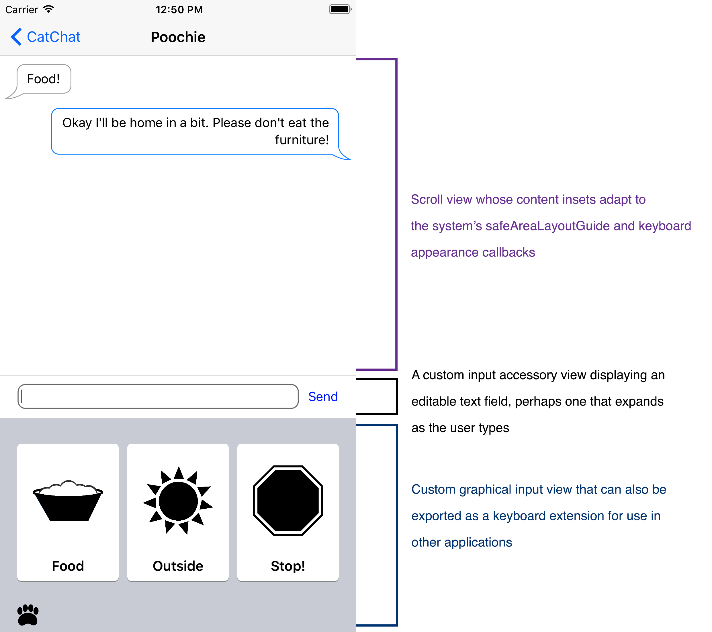

# Implementing Advanced Text Input Features

This project demonstrates how to implement many common user interface patterns surrounding the iOS keyboard, as well as how to create a custom keyboard extension.


## Overview

A typical chat application might be designed as follows:



This sample project will show you how to configure your app's scroll view to take advantage of the automatic keyboard avoidance behavior provided by iOS, how to create a custom view that can be attached to the keyboard (called the `inputAccessoryView`), as well as how to bootstrap a basic custom keyboard extension that can be used throughout the system.


## Input Accessory Views

For information about how to create custom input accessory views, consult `ChatInputAccessoryView.swift` and `ConversationViewController.swift` for how to use it.


## Hardware Keyboard Shortcuts

There are a number of hardware keyboard shortcuts defined in `ConversationViewController.swift` for navigating around messages.

``` swift
override var keyCommands: [UIKeyCommand]? {
    return [
        // Command + Down arrow goes to the next conversation
        UIKeyCommand(input: UIKeyInputDownArrow,
                     modifierFlags: .command,
                     action: #selector(switchToConversationKeyCommandInvoked(sender:)),
                     discoverabilityTitle: NSLocalizedString("GO_TO_NEXT_CONVERSATION", comment: "")),

        // Command + Up arrow goes to the previous conversation
        UIKeyCommand(input: UIKeyInputUpArrow,
                     modifierFlags: .command,
                     action: #selector(switchToConversationKeyCommandInvoked(sender:)),
                     discoverabilityTitle: NSLocalizedString("GO_TO_PREV_CONVERSATION", comment: ""))
    ]
}
```
[View in Source](x-source-tag://keycommands)


## Custom Input View

For an example of a custom graphical keyboard extension, consult the `AnimalInputViewController` class. To bootstrap your own custom keyboard extension:

1. Create a new "Custom Keyboard Extension" target in Xcode's project settings.
2. Modify the provided `UIInputViewController` subclass from the template.
3. Add your own globe key button that forwards control events to `UIInputViewController.handleInputModeList(from view: UIView, with event: UIEvent)`.
4. Build and run.

As of iOS 11, your users will also now be able to enable your custom keyboard extension via your app's settings bundle. To do this, simply ensure that a Settings bundle is included in your project.
